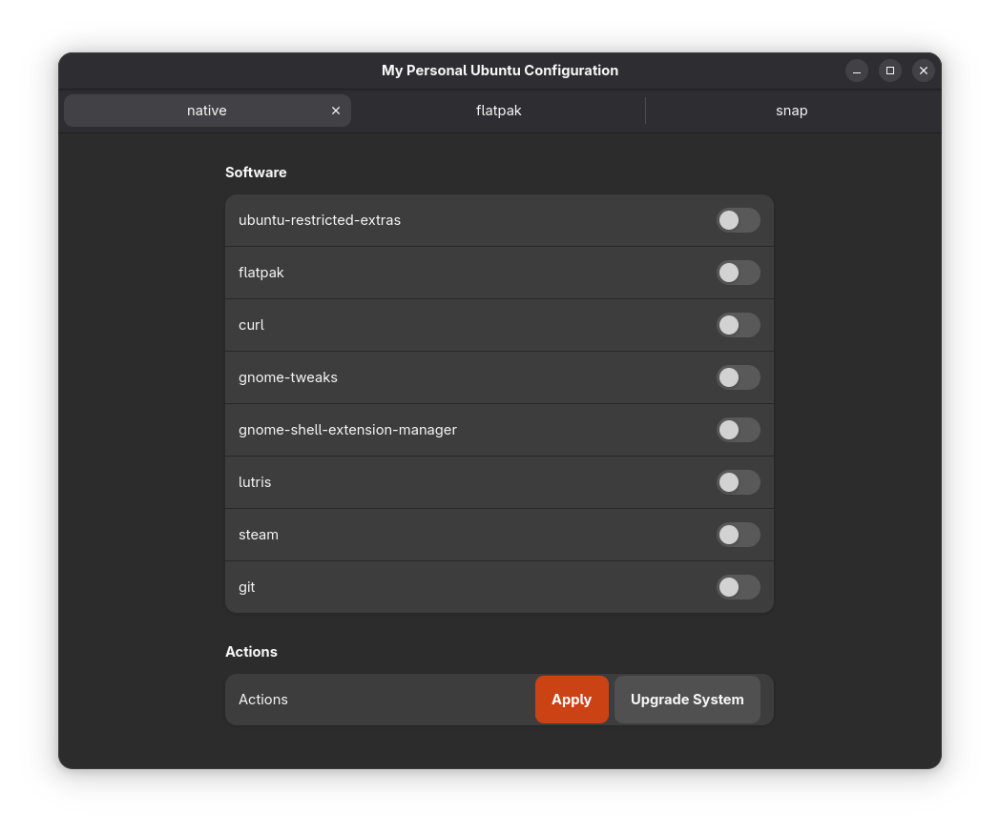

# ubuntu-post-installer
My personal ubuntu software install. 
Created only for studies propos.

Compatibility: Ubuntu 25.04

Next steps:
- fix screen to close program (waiting)
- Clean all checkbox after install
- Load fedora installed packages
- Better feedback during process executions
- Block multiple clicks
- Not share packages between tabs
- Tab to configure with system configuration ( GRUB, FONTS, ICONS, THEMES ... )
- Organize the project in packages
- Maybe package this util (.deb, snap, flatpak)